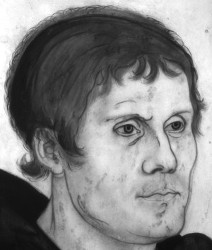
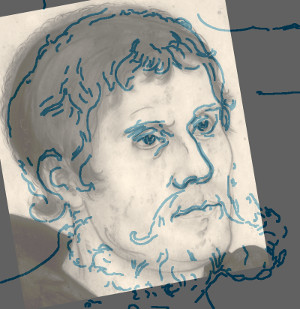

# affine-overlay
Overlay of two images using an affine transformation of corresponding points

This program overlays/blends two images (or their contours) with each 
other. For this process first three (affine) or more points 
(perspective) have to be selected at the two images (note: the point 
order must match). With _space_ you continue to the next view. At the 
end you see the result, if you want to redo: press _r_.

## Example

### Original Images

### Overlay

